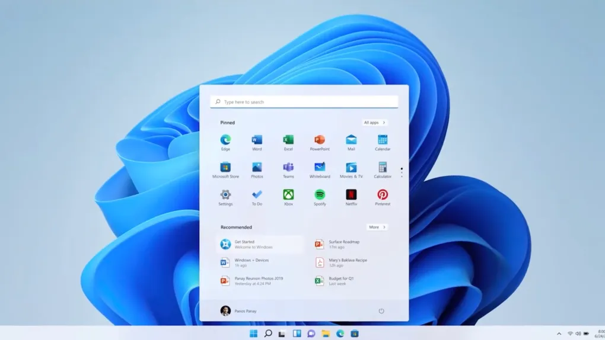

[](https://classroom.github.com/a/vbnbTt5m)
[](https://classroom.github.com/online_ide?assignment_repo_id=15279066&assignment_repo_type=AssignmentRepo)
# Dev_Setup
Setup Development Environment

#Assignment: Setting Up Your Developer Environment

#Objective:
This assignment aims to familiarize you with the tools and configurations necessary to set up an efficient developer environment for software engineering projects. Completing this assignment will give you the skills required to set up a robust and productive workspace conducive to coding, debugging, version control, and collaboration.

#Tasks:

1. Select Your Operating System (OS):
   Choose an operating system that best suits your preferences and project requirements. Download and Install Windows 11. https://www.microsoft.com/software-download/windows11
   

a. Prepare Your Flash Drive: Make sure you have a USB flash drive with at least 8GB of space. Back up any important data, as this process will erase everything on the drive.

b. Download the Windows 11 ISO: Visit the official Microsoft website and download the Windows 11 ISO file.

c. Create a Bootable USB Drive: Use a tool like Rufus to make your flash drive bootable. Open Rufus, select the Windows 11 ISO file, and choose your USB drive. Click "Start" and let the tool do its work.

d. Set Up Your PC to Boot from USB: Restart your computer and enter the BIOS or UEFI settings. Change the boot order so that your PC boots from the USB drive first. Save the changes and exit.

e. Install Windows 11: With the USB drive inserted, your computer should boot into the Windows 11 installation screen. Follow the on-screen instructions to complete the installation process. Choose your language, enter your product key, and select the installation type (custom is usually best for a clean install).

f. Complete the Installation: After the initial setup, Windows will restart several times. Follow any additional prompts to set up your user account, preferences, and privacy settings.

g. Update: Once the installation is complete, check for updates to ensure your system has the latest features and security patches.

2. Install a Text Editor or Integrated Development Environment (IDE):
   Select and install a text editor or IDE suitable for your programming languages and workflow. Download and Install Visual Studio Code. https://code.visualstudio.com/Download

   -Download Visual Studio Code: Go to the official Visual Studio Code website and click the download button for Windows. This will download the installer to your computer.

a-Run the Installer: Once the download is complete, open the installer file. You might need to allow the installer to make changes to your device by clicking "Yes" on the prompt.

b-Accept the License Agreement: Read through the license terms and conditions, then click "I accept the agreement" and proceed by clicking "Next."

c-Choose Installation Location: Select the destination folder where you want to install Visual Studio Code. The default location is usually fine, so you can just click "Next."

d-Select Additional Tasks: You'll be asked to choose additional tasks like creating a desktop icon or adding context menu options. Check the boxes for the options you prefer, then click "Next."

e-Install Visual Studio Code: Click "Install" to begin the installation process. This might take a few minutes.

f-Launch Visual Studio Code: Once the installation is complete, ensure the "Launch Visual Studio Code" option is checked, then click "Finish." Visual Studio Code will open, and you're ready to start coding!

3. Set Up Version Control System:
   Install Git and configure it on your local machine. Create a GitHub account for hosting your repositories. Initialize a Git repository for your project and make your first commit. https://github.com

a. Download Git: Visit the official Git website and download the latest version for Windows. Click on the download link to save the installer to your computer.

b. Run the Installer: Locate the downloaded installer file and double-click it to start the installation process. You may need to allow the installer to make changes to your device by clicking "Yes" on the prompt.

c. Setup Git Installation: Follow the installation wizard. Most users can keep the default settings, but you can customize the options as needed. Click "Next" on each step until you reach the "Install" button.

d. Complete Installation: Click "Install" and wait for the installation to finish. Once done, click "Finish" to exit the installer.

e. Open Git Bash: After installation, open Git Bash from the Start menu or desktop shortcut. This is the command-line interface you'll use to interact with Git.

f. Configure Your User Name: In Git Bash, type the following command to set your global username:
   ```sh
   git config --global user.name "Your Name"
   ```
   Replace `"Your Name"` with your actual name on th.

g. Configure Your Email: Next, set your global email address with this command:
   ```sh
   git config --global user.email "your.email@example.com"
   ```
   Replace `"your.email@example.com"` with your actual email address.

h. Verify Configuration: To confirm that your settings have been applied correctly, type:
   ```sh
   git config --list
   ```
   This command will display your current Git configuration.

j. Open Git Bash: Right-click inside your project folder and select "Git Bash Here" to open Git Bash in the current directory.

k. Initialize the Git Repository: In Git Bash, type the following command to initialize a new Git repository:
   ```sh
   git init
   ```
   This will create a hidden `.git` folder in your project directory, marking it as a Git repository.

m. Add Your Files to the Repository: To add all your project files to the staging area, use the following command:
   ```sh
   git add .
   ```
   The `.` tells Git to add all files and directories in the current directory.

n. Make Your First Commit: Now, commit the staged files to your repository with a descriptive message:
   ```sh
   git commit -m "Initial commit"
   ```
   Replace `"Initial commit"` with your own message if desired.

o. Verify Your Commit: To check that your commit was successful, you can view the commit history with:
   ```sh
   git log
   ```
   This command will display a list of commits, including your initial commit.


4. Install Necessary Programming Languages and Runtimes:
  Instal Python from http://wwww.python.org programming language required for your project and install their respective compilers, interpreters, or runtimes. Ensure you have the necessary tools to build and execute your code.

5. Install Package Managers:
   If applicable, install package managers like pip (Python).

a. Download Python: Visit the official Python website at [python.org](https://www.python.org/). Click on the "Downloads" tab and select "Download Python" for Windows.

b. Run the Installer: Once the download is complete, open the installer file. Check the box that says "Add Python to PATH," then click "Install Now."

c. Complete the Installation: The installer will set up Python on your system. When the installation is complete, you can close the installer.

d. Verify Python Installation: Open Command Prompt or PowerShell and type:
   ```sh
   python --version
   ```
   This command will display the installed Python version, confirming that Python is correctly installed.

e. Install pip: Pip is the package installer for Python and should be included with Python. Verify it by typing:
   ```sh
   pip --version
   ```
   If pip is installed, this command will display its version.

f. Install Necessary Packages: Use pip to install any additional packages or tools you need for your project. For example, to install `numpy` and `requests`, type:
   ```sh
   pip install numpy requests
   ```

g. Set Up a Virtual Environment (Optional): It’s a good practice to create a virtual environment for your project. This keeps dependencies isolated. Create a virtual environment with:
   ```sh
   python -m venv myenv
   ```
   Activate the virtual environment with:
   ```sh
   myenv\Scripts\activate
   ```
   Once activated, you can use pip to install packages within this environment.

h. Verify Installation of Compilers/Interpreters: I already have Visual Studio code.


6. Configure a Database (MySQL):
   Download and install MySQL database. https://dev.mysql.com/downloads/windows/installer/5.7.html


a. Download MySQL Installer: Go to the official MySQL website at [mysql.com](https://www.mysql.com/). Click on "Downloads" and select "MySQL Community (GPL) Downloads". Then, choose "MySQL Installer for Windows".

b. Run the Installer: Once the download is complete, open the installer file. If prompted, allow the installer to make changes to your device.

c. Choose Setup Type: The installer will present several setup types. For most users, the "Developer Default" is suitable as it includes MySQL Server, MySQL Workbench, and other useful tools. Select your preferred setup type and click "Next".

d. Check Requirements: The installer will check for any required software that you might need. If any prerequisites are missing, the installer will prompt you to download and install them. Follow the prompts to install any necessary components.

e. Install MySQL: Click "Execute" to start the installation process. This will install the selected MySQL products on your system. This step might take a few minutes.

f. Configuration: After the installation, the installer will guide you through the initial configuration. Choose "Standalone MySQL Server" and click "Next". Configure your MySQL Server by setting the desired root password and other options such as user accounts and network settings. Click "Next" after each step to proceed.

g. Start MySQL Server: Ensure that the MySQL Server is set to start as a service automatically. Click "Next" and then "Execute" to apply the configuration settings.

h. Complete Installation: Once the configuration is complete, click "Finish". MySQL Workbench will launch, allowing you to manage your databases.

i. Verify Installation: Open MySQL Workbench and connect to your local MySQL server using the root password you set during the configuration. You should see the MySQL server and be able to start creating and managing databases.


7. Set Up Development Environments and Virtualization (Optional):
   Consider using virtualization tools like Docker or virtual machines to isolate project dependencies and ensure consistent environments across different machines.

8. Explore Extensions and Plugins:
   Explore available extensions, plugins, and add-ons for your chosen text editor or IDE to enhance functionality, such as syntax highlighting, linting, code formatting, and version control integration.

9. Document Your Setup:
    Create a comprehensive document outlining the steps you've taken to set up your developer environment. Include any configurations, customizations, or troubleshooting steps encountered during the process. 

#Deliverables:
- Document detailing the setup process with step-by-step instructions and screenshots where necessary.
- A GitHub repository containing a sample project initialized with Git and any necessary configuration files (e.g., .gitignore).
- A reflection on the challenges faced during setup and strategies employed to overcome them.

#Submission:
Submit your document and GitHub repository link through the designated platform or email to the instructor by the specified deadline.

#Evaluation Criteria:**
- Completeness and accuracy of setup documentation.
- Effectiveness of version control implementation.
- Appropriateness of tools selected for the project requirements.
- Clarity of reflection on challenges and solutions encountered.
- Adherence to submission guidelines and deadlines.

Note: Feel free to reach out for clarification or assistance with any aspect of the assignment.
